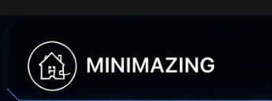
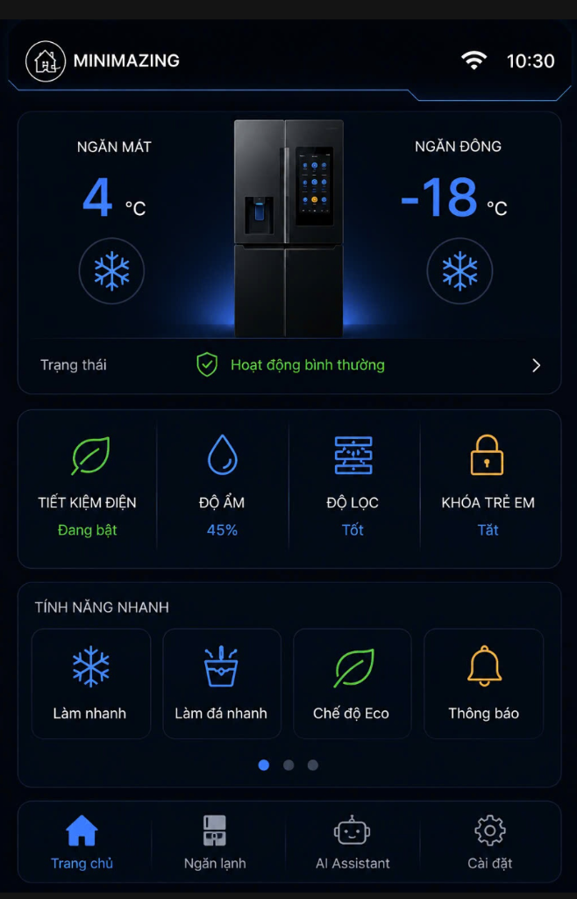
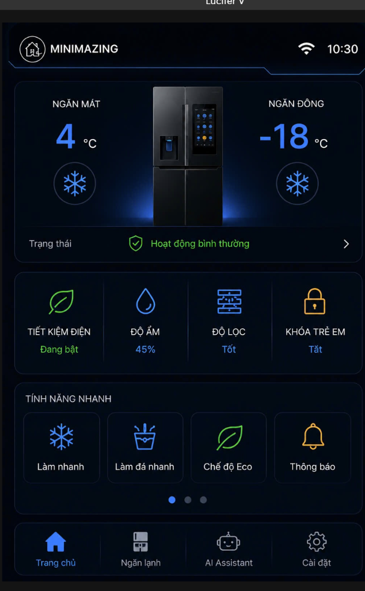
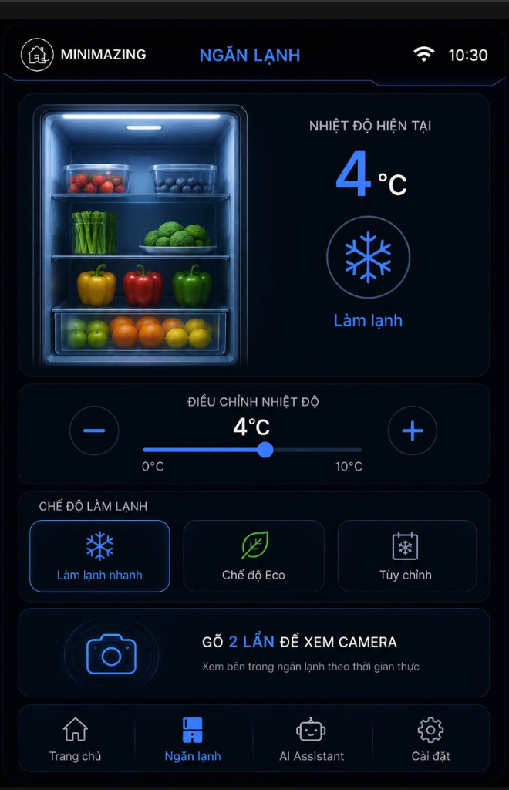
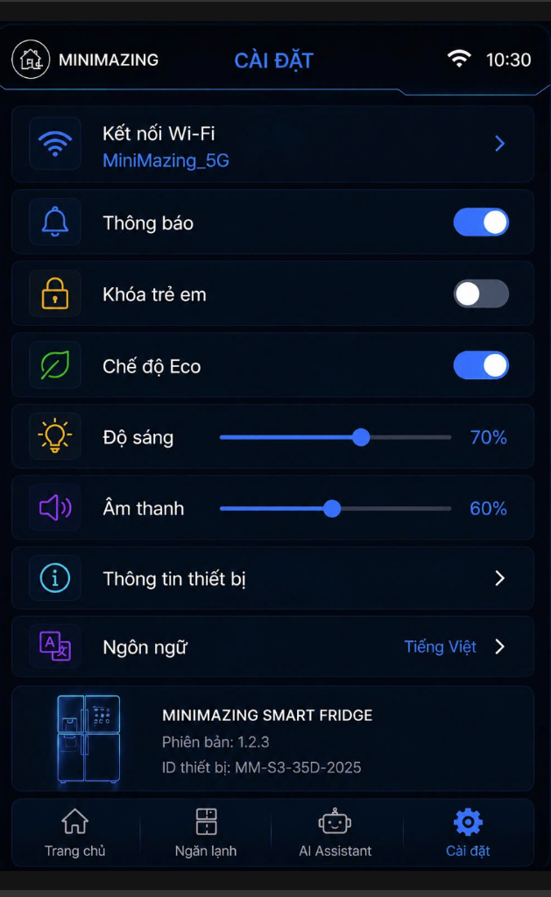

# Smart Fridge Dashboard Agent (ESP32-S3 3.5" IPS) ❄️🤖

<p align="center">
  
</p>

Hệ thống bảng điều khiển trung tâm dành cho **Tủ Lạnh Thông Minh (Smart Refrigerator Dashboard)** vận hành trên vi điều khiển **ESP32-S3 WROOM-1** kết hợp màn hình cảm ứng điện dung 3.5 inch IPS (320x480) và bộ giải mã âm thanh chuyên dụng Everest ES8311.

---

## 1. Giao Diện & Tính Năng Nổi Bật

<p align="center">
  
  
</p>
<p align="center">
  
  
</p>

* 🧊 **Dark Mode UI Hiện Đại**: Xây dựng trên nền tảng đồ họa LVGL 8.3, tối ưu bộ đệm màn hình PSRAM 8MB cho hiệu năng 60 FPS mượt mà.
* ❄️ **Quản Lý Làm Lạnh Đa Vùng**: Điều khiển nhiệt độ ngăn mát (0°C ~ 8°C) và ngăn đông (-24°C ~ -14°C) bằng slider trực quan kèm các chế độ làm lạnh nhanh (Super Cool, Super Freeze, Eco Mode).
* 🎙️ **Trợ Lý Giọng Nói AI**: Tích hợp pipeline thu âm qua I2S Codec ES8311, hiệu ứng sóng âm động (waveform micro) và kết nối trí tuệ nhân tạo Groq / Llama-3.
* 📶 **Quản Lý Wi-Fi & Đồng Bộ Giờ NTP**: Bàn phím ảo trực tiếp trên màn hình, quét và kết nối mạng Wi-Fi tự động, đồng bộ thời gian chuẩn Việt Nam (GMT+7).
* 💡 **Tiết Kiệm Điện Năng Thông Minh**: Tự động giảm độ sáng và tắt đèn nền (Backlight Timeout) sau 30 giây không tương tác; chạm nhẹ vào màn hình để đánh thức lập tức.

---

## 2. Thông Số Phần Cứng Hỗ Trợ

| Phần Cứng | Thông Số Kỹ Thuật |
| :--- | :--- |
| **Vi điều khiển** | ESP32-S3 Dual-Core Xtensa LX7, 16MB Flash, 8MB Octal PSRAM |
| **Màn hình hiển thị** | 3.5 inch IPS LCD (320x480), Controller ST7796S (Giao tiếp QSPI / SPI) |
| **Cảm ứng** | Capacitive Multi-touch Controller (I2C Địa chỉ `0x55` / GT911 / FT6236) |
| **Âm thanh** | Everest ES8311 Low-Power Audio Codec (I2C `0x18`, I2S Audio) + Amply NS4150 |
| **Micro** | Analog MEMS Microphone với mạch khuếch đại PGA tích hợp |

### Bảng Sơ Đồ Chân Kết Nối (Hardware Pinout)

| Thiết Bị | Chân ESP32-S3 | Chức Năng |
| :--- | :--- | :--- |
| **LCD ST7796S** | `GPIO 10` (CS), `GPIO 12` (SCK), `GPIO 11` (D0), `GPIO 13` (D1), `GPIO 14` (D2), `GPIO 9` (D3), `GPIO 41` (PWM Backlight) |
| **Cảm Ứng (Touch)** | `GPIO 38` (SDA), `GPIO 39` (SCL), `GPIO 48` (RST), `GPIO 47` (INT) |
| **Audio ES8311** | `GPIO 17` (MCLK), `GPIO 18` (BCLK), `GPIO 21` (WS), `GPIO 15` (DOUT), `GPIO 16` (DIN), `GPIO 1` (PA EN - Active LOW) |

---

## 3. Hướng Dẫn Nạp Firmware (Binary Release)

Repository này phát hành trực tiếp các gói nhị phân đã biên dịch sẵn trong thư mục [`firmware/`](firmware/), cho phép bạn nạp và chạy ngay trên mạch mà không cần cấu hình môi trường code hay thư viện.

Các file nhị phân tương ứng với các phân vùng bộ nhớ Flash 16MB:
* `0x0000`: `firmware/bootloader.bin` (ESP-IDF 2nd stage bootloader)
* `0x8000`: `firmware/partitions.bin` (Partition Table 16MB)
* `0xe000`: `firmware/boot_app0.bin` (OTA Data selection)
* `0x10000`: `firmware/firmware.bin` (Ứng dụng chính Smart Fridge Agent)

---

### Cách 1: Nạp Trực Tiếp Qua Web (Khuyến Nghị - Đơn Giản Nhất)
Không cần cài đặt bất kỳ phần mềm nào, chỉ cần dùng trình duyệt **Google Chrome** hoặc **Microsoft Edge**:
1. Truy cập công cụ nạp web: [https://esp.huhn.me/](https://esp.huhn.me/) hoặc [ESP Web Tools](https://espressif.github.io/esptool-js/).
2. Cắm cáp Type-C từ máy tính vào mạch ESP32-S3 và bấm nút **Connect** trên trang web để chọn cổng COM.
3. Thêm các file từ thư mục `firmware/` với đúng địa chỉ offset sau:
   * Địa chỉ `0x0`: chọn file `bootloader.bin`
   * Địa chỉ `0x8000`: chọn file `partitions.bin`
   * Địa chỉ `0xe000`: chọn file `boot_app0.bin`
   * Địa chỉ `0x10000`: chọn file `firmware.bin`
4. Bấm **Program** để nạp. Quá trình hoàn tất sau khoảng 15-30 giây.

---

### Cách 2: Nạp Nhanh Bằng 1-Click (`flash.bat` / `flash.sh`)
* **Trên Windows**: Cắm cáp USB vào máy tính -> Nhấp đúp chuột chạy file **[`flash.bat`](flash.bat)** -> Nhập tên cổng COM (ví dụ: `COM8`) -> Nhấn Enter. Script sẽ tự động nạp toàn bộ firmware.
* **Trên macOS / Linux**: Mở Terminal và chạy:
  ```bash
  chmod +x flash.sh
  ./flash.sh
  ```

---

### Cách 3: Nạp Bằng Dòng Lệnh `esptool`
Nếu bạn đã có Python trên máy tính:
```bash
pip install esptool
python -m esptool --chip esp32s3 -b 921600 --before default_reset --after hard_reset write_flash -z --flash_mode dio --flash_freq 80m --flash_size 16MB 0x0 firmware/bootloader.bin 0x8000 firmware/partitions.bin 0xe000 firmware/boot_app0.bin 0x10000 firmware/firmware.bin
```

---

## 4. Bản Quyền & Điều Khoản Sử Dụng
Mọi quyền sở hữu trí tuệ, thiết kế giao diện và thuật toán nhúng thuộc về tác giả. Firmware được cung cấp dưới dạng nhị phân phục vụ mục đích trải nghiệm và thử nghiệm phần cứng. Cấm sao chép, dịch ngược mã hoặc sử dụng cho mục đích thương mại khi chưa có sự đồng ý bằng văn bản của tác giả.
