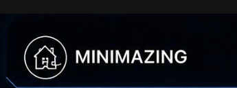
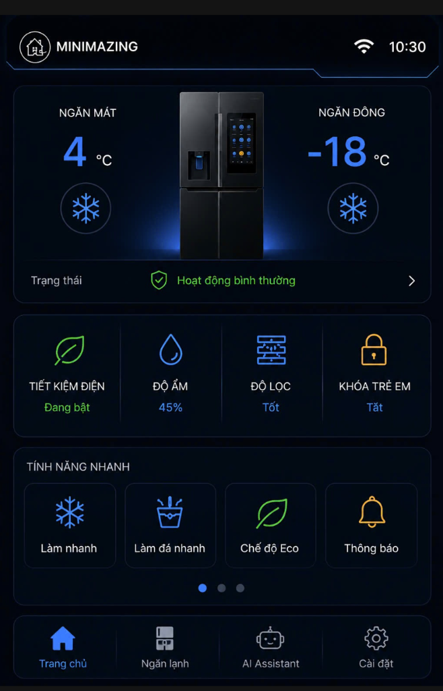
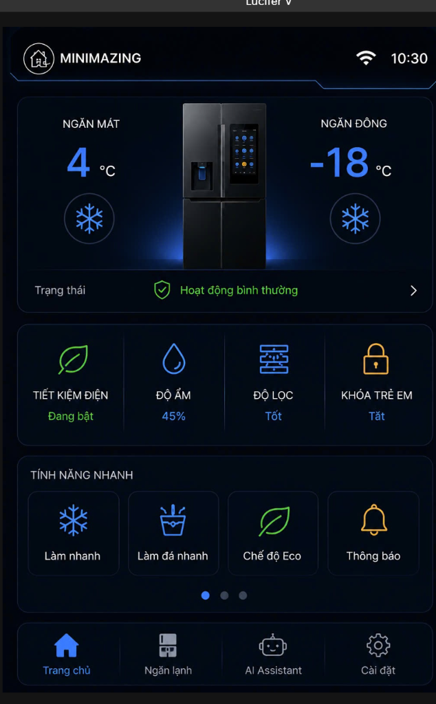
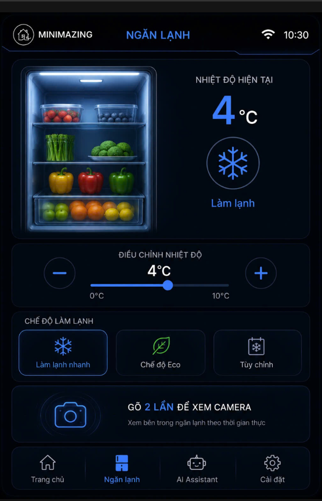
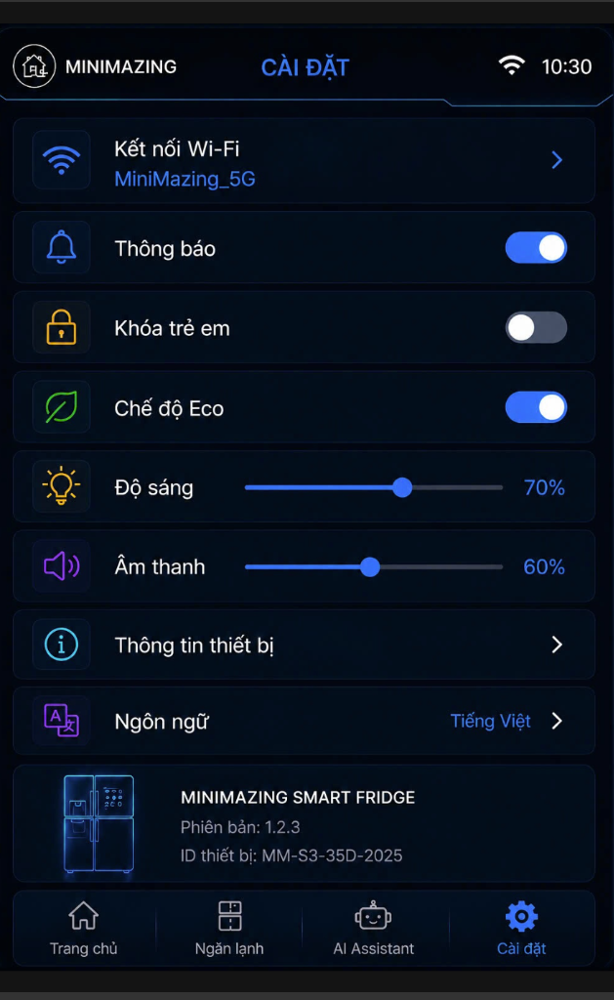

# Smart Fridge Dashboard Agent (ESP32-S3 3.5" IPS) ❄️🤖

<p align="center">
  
</p>

Hệ thống bảng điều khiển trung tâm dành cho **Tủ Lạnh Thông Minh (Smart Refrigerator Dashboard)** vận hành trên vi điều khiển **ESP32-S3 WROOM-1** kết hợp màn hình cảm ứng điện dung 3.5 inch IPS (320x480) và bộ giải mã âm thanh chuyên dụng Everest ES8311.

---

## 1. Giao Diện & Tính Năng Nổi Bật

<p align="center">
  
  
</p>
<p align="center">
  
  
</p>

* 🧊 **Dark Mode UI Hiện Đại**: Xây dựng trên nền tảng đồ họa LVGL 8.3, tối ưu bộ đệm màn hình PSRAM 8MB cho hiệu năng 60 FPS mượt mà.
* ❄️ **Quản Lý Làm Lạnh Đa Vùng**: Điều khiển nhiệt độ ngăn mát (0°C ~ 8°C) và ngăn đông (-24°C ~ -14°C) bằng slider trực quan kèm các chế độ làm lạnh nhanh (Super Cool, Super Freeze, Eco Mode).
* 🎙️ **Trợ Lý Giọng Nói AI**: Tích hợp pipeline thu âm qua I2S Codec ES8311, hiệu ứng sóng âm động (waveform micro) và kết nối trí tuệ nhân tạo Groq / Llama-3.
* 📶 **Quản Lý Wi-Fi & Đồng Bộ Giờ NTP**: Bàn phím ảo trực tiếp trên màn hình, quét và kết nối mạng Wi-Fi tự động, đồng bộ thời gian chuẩn Việt Nam (GMT+7).
* 💡 **Tiết Kiệm Điện Năng Thông Minh**: Tự động giảm độ sáng và tắt đèn nền (Backlight Timeout) sau 30 giây không tương tác; chạm nhẹ vào màn hình để đánh thức lập tức.

---

## 2. Thông Số Phần Cứng Hỗ Trợ

| Phần Cứng | Thông Số Kỹ Thuật |
| :--- | :--- |
| **Vi điều khiển** | ESP32-S3 Dual-Core Xtensa LX7, 16MB Flash, 8MB Octal PSRAM |
| **Màn hình hiển thị** | 3.5 inch IPS LCD (320x480), Controller ST7796S (Giao tiếp QSPI / SPI) |
| **Cảm ứng** | Capacitive Multi-touch Controller (I2C Địa chỉ `0x55` / GT911 / FT6236) |
| **Âm thanh** | Everest ES8311 Low-Power Audio Codec (I2C `0x18`, I2S Audio) + Amply NS4150 |
| **Micro** | Analog MEMS Microphone với mạch khuếch đại PGA tích hợp |

### Bảng Sơ Đồ Chân Kết Nối (Hardware Pinout)

| Thiết Bị | Chân ESP32-S3 | Chức Năng |
| :--- | :--- | :--- |
| **LCD ST7796S** | `GPIO 10` (CS), `GPIO 12` (SCK), `GPIO 11` (D0), `GPIO 13` (D1), `GPIO 14` (D2), `GPIO 9` (D3), `GPIO 41` (PWM Backlight) |
| **Cảm Ứng (Touch)** | `GPIO 38` (SDA), `GPIO 39` (SCL), `GPIO 48` (RST), `GPIO 47` (INT) |
| **Audio ES8311** | `GPIO 17` (MCLK), `GPIO 18` (BCLK), `GPIO 21` (WS), `GPIO 15` (DOUT), `GPIO 16` (DIN), `GPIO 1` (PA EN - Active LOW) |

---

---

## 3. Hướng Dẫn Biên Dịch & Nạp Code Từ Nguồn (PlatformIO)

Dự án hiện tại hỗ trợ nạp code trực tiếp từ mã nguồn C++ (không cần nạp file bin thủ công).

### Cách 1: Nạp Tự Động Bằng 1-Click (`flash.bat` / `flash.sh`)
* **Trên Windows**: Cắm cáp Type-C vào ESP32-S3 -> Nhấp đúp chạy **[`flash.bat`](flash.bat)** -> Nhập cổng COM (hoặc nhấn Enter để tự động nhận COM8) -> Script sẽ tự động gọi PlatformIO biên dịch mã nguồn và nạp thẳng vào vi điều khiển.
* **Trên macOS / Linux**: Mở Terminal và chạy:
  ```bash
  chmod +x flash.sh
  ./flash.sh
  ```

---

### Cách 2: Biên Dịch & Nạp Qua Dòng Lệnh PlatformIO CLI
Mở terminal tại thư mục gốc dự án và chạy:
```bash
# 1. Biên dịch toàn bộ mã nguồn
pio run

# 2. Biên dịch và nạp trực tiếp vào ESP32-S3 (COM8)
pio run -t upload

# 3. Mở Serial Monitor để theo dõi log
pio device monitor -b 115200
```

---

### Cách 3: Phát Triển Trực Tiếp Trong VS Code
1. Cài đặt tiện ích mở rộng **PlatformIO IDE** trong Visual Studio Code.
2. Mở thư mục dự án `fride_smart`.
3. Bấm vào biểu tượng **Build** (✓) dưới thanh trạng thái để biên dịch, hoặc **Upload** (→) để nạp code vào mạch.

---

## 4. Bản Quyền & Điều Khoản Sử Dụng
Mọi quyền sở hữu trí tuệ, thiết kế giao diện và thuật toán nhúng thuộc về tác giả Vincent (@trandat09062003). Dự án phục vụ mục đích nghiên cứu, học tập và trải nghiệm sản phẩm IoT AI Agent thông minh.

